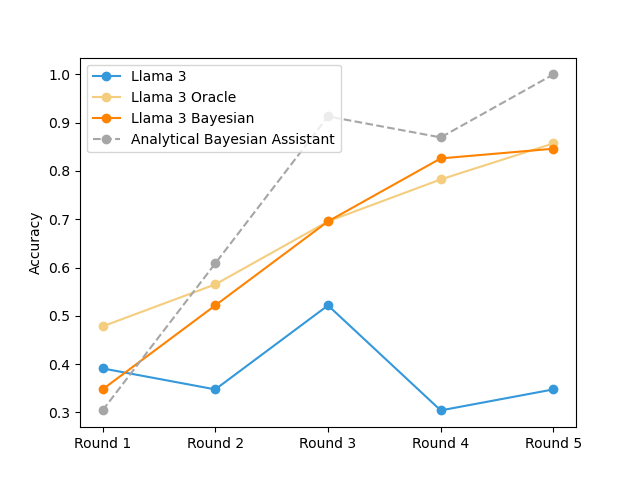

## Introduction

Reference: Qiu, Linlu, et al. "Bayesian teaching enables probabilistic reasoning in large language models." Nature Communications (2026).
https://www.nature.com/articles/s41467-025-67998-6

One of the surpising things about most LLM's is that they are poor at adapting to a user's preferences. Qiu et. al (2026) explore the the idea of fine tuning LLM's to be Bayesian Assistants, where the models take into account prior information to provide recommendations that are more aligned with the user. They fine-tuned several LLM's including LLama 3, Qwen, and Gemma 2, and report increased accuracy from the original LLM version, which approaches the accuracy of analytical Bayesian updates. I wanted to try to understand how they did this, so this post attempts to replicate results in their paper.

The models were tuned and tested with a flight recommendation task, where 3 flight options are presented to the model with a few features like flight duration, price, departure time, and number of stops. The model returns a recommendation, and this continues for 5 rounds, where the model receives feedback about the user's choice in the previous round. The user's preferences are modeled using a reward function with weights for each feature on the scale of -1 to 1, in increments of 0.5. 

## Analytical Bayesian Assisitant

The discrete design allows for exact analytical Bayesian updates, which is an intentional design by the authors to estimate how LLM's deviate. The analytical posterior is updated each round using:

$$ q_B^{i+1}(\theta | \mathcal O^{i+1}, o^{*i+1}) = \frac{p(o^{*i+1} | \theta, \mathcal O^{i+1}) q_B^{i}(\theta)}{p(o^{*i+1} | \mathcal O^{i+1})}$$

where $\theta$ is a vector of all possible reward functions, $\mathcal O$ are the flight options, and $o$ is the prefered option in round $i$. The likelihood $p(o^* | \theta, \mathcal O)$ is calculated using the users true preference $ o^{*} $ (after the model's predicition) with:

$$ p(o^* | \theta, \mathcal O) =  1 [\text{max}_{o \in \mathcal O} \space r(o;\theta) = o^* ]$$

which is an indicator function applying a 1 where the model's prediction matches $o^*$ and zero otherwise. Since the prior and posterior is a vector of all possible $\theta$'s in a discrete space, the likelihood*prior results in a zero at the $\theta$'s where the model and user disagree, so those $\theta$'s will be zero in the prior and posterior moving forward, and never selected again. For example, the discrete space for a setup with 4 flight features (i.e. price, duration, departure time, number of stops) has a dimension of 624, since there are this many possible combinations of the user preference [-1, -.5, 0, .5, 1] with 4 different features. The reward $r(o;\theta)$ is found by multiplying the prior by features for each flight option. The LLM's receive a text version of the flight options and features, while the authors have provided the features scaled numerically between 0 and 1 for analytical Bayesian updates.

For a space with 2 features (price and duration), the following function calculates the Bayesian prediction for 5 rounds in a vectorized way.

``` python
def bayesian_assistant_prediction(data):

    values = [-1.0, -0.5, 0.0, 0.5, 1.0]

    thetas = np.array([[a,b] for a in values for b in values])  # (25,2)

    # prior over thetas is uniform
    posterior = np.ones(len(thetas)) / len(thetas)

    predictions = []
    user_idxs = []
    for i in range(5):

        # access the flights for the current round
        flights = np.array(data["rounds_numpy"][i])  # shape(3,2)

        # reward for every theta and every flight
        rewards = np.dot(thetas,flights.T)   # shape (25, 3)

        # best choice calculated for every theta
        pred_choice = np.argmax(rewards, axis=1)  # shape (25,)

        # expected reward for each flight
        expected_rewards = (posterior.reshape(-1,1) * rewards).sum(axis=0)  # (3,)

        # prediction is the flight with the highest expected reward
        predictions.append(np.argmax(expected_rewards))
        
        # update posterior. start by calculating likelihood of the observed choice for each theta
        chosen_idx = data["rounds"][i]["user_idx"]
        user_idxs.append(chosen_idx)
        likelihood = (pred_choice == chosen_idx).astype(float) # shape (25,)

        # multiply the prior by the likelihood - prior is posterior from previous round
        posterior = posterior * likelihood

        # normalize
        posterior /= posterior.sum()

    return np.array(predictions), np.array(user_idxs)

```

The discrete design with a relatively small space of possible reward functions allows this calculation to be very efficient. But as the feature space or increments between user preferences grows, the calculations would become unmanagable. One thought is to reframe the problem in a continuous space, and use a sampler like PyMC to make the posterior updates with a Multinomial regression model ... maybe this can be the subject of a new post!

## Fine-tuned Llama models

The authors performed full end-to-end fine tuning of model weights using the [alignment-handbook](https://github.com/huggingface/alignment-handbook) pipeline and GPU acceleration (4x H100). It would be a fun project to try to replicate the fine-tuning process, but for now I will show how to evaluate their models that are available on [https://huggingface.co/collections/linluqiu/bayesian-teaching](https://huggingface.co/collections/linluqiu/bayesian-teaching). I will evaluate the Llama 3 8B models in `Ollama`, and compare them to the analytical posterior updates as well as the original Llama 3 8B. The authors fine-tuned 2 models with Llama

1) Llama-Bayesian - trained to construct an implicit model about user preferences, and update the model as it learns more information
2) Llama-Oracle - trained with series of correct answers, but is not taught to make Bayesian updates to reasoning

These models can be downloaded using the `HuggingFace` API


``` python
from huggingface_hub import snapshot_download

# llama_oracle download:
snapshot_download(repo_id="linluqiu/llama_oracle", local_dir="llama_oracle")

# llama_bayesian download:
snapshot_download(repo_id="linluqiu/llama_bayesian", local_dir="llama_bayesian")
```

Then in each directory, create a `ModelFile` including only this text:

```
FROM .

PARAMETER temperature 0.0
PARAMETER top_p 1.0
```

Navigate to each directory in a terminal, and execute this command to create each model in `Ollama`:

```
ollama create bayesian-assistant -f Modelfile

ollama create oracle-assistant -f Modelfile
```

Awesome! Now the models can be accessed locally, and I can run inference to replicate the results. The following function runs the model through 5 rounds of interogation on flight preferences using the 2-feature version with price and duration, and returns both the model's prediction and user choice in each round for accuracy calculation. This prompting setup works well in the 2-feature space, but does not work well when more features are introduced. I'm thinking the models are very sensitive to the prompt, or a 2-feature trained version was uploaded to HuggingFace.


``` python 

def model_inference(model_name, num_samples=23):

    accuracy_array = np.zeros((num_samples, 5)) * np.nan

    DATA_PATH = "eval/interaction/flight_2features.jsonl"

    with open(DATA_PATH, "r") as f:
        # use tqdm to show progress
        for i, line in enumerate(tqdm(f, total=num_samples)):
            if i >= num_samples: break
            
            data = json.loads(line)

            for round_idx in range(5):

                # initialize the content for the prompt
                content = """Help me select the best flights for my trips. 
    I have specific preferences for what I like and dislike in a flight, and these preferences remain the same. 
    You need to figure out my preferences and select the best flights for me. 
    Use your best judgment if you are unsure. Do not say you need more information.
    Do not explain your answer.
    Do not output anything except one line.
    Answer only with:
    Answer: 1
    Answer: 2
    Answer: 3


    """
                #add previous rounds:
                for r_idx, prev_round in enumerate(data['rounds'][:round_idx]):
                    content += f"Round {r_idx + 1}\n\n"
                    content += "Flights\n\n"
                    for opt in prev_round['options']:
                        content += f"{opt}\n"
             
                    content += "\n"
                    content += f"User chose: {prev_round['options'][prev_round['user_idx']].split(':')[0]}\n\n"

                #now add current round:
                current_round = data['rounds'][round_idx]
                content += f"Round {round_idx + 1}\n\n"
                content += "Flights\n\n"

                for opt in current_round['options']:
                    content += f"{opt}\n"
                content += "\n"
                content += "Recommendation:"

                messages = [
                    {
                    "role":"user",
                    "content":content}
                ]
                
                response = ollama.chat(model=model_name, messages=messages, 
                                       options={"temperature": 0,"top_p": 1,"num_predict": 5})

                #get content from response
                response_content = response['message']['content']
                
                # find the number within the response
                try:
                    pred = int(''.join(filter(str.isdigit, response_content))[0])
                    accuracy_array[i, round_idx] = pred == (current_round['user_idx'] + 1)
                except:
                    accuracy_array[i, round_idx] = np.nan

    return accuracy_array

```

## Accuracy Results

Accuracies for each model per round are calculated based on the ratio of correct predictions in all 23 users for the 2-feature dataset. These results generally agree with the paper, in that Bayesian and Oracle LLM models outperform the original LLM. But the paper does show that the Bayesian LLM outperforms the Oracle, which might be caused by the small sample size or relative simplicity of the 2-feature dataset. As noted before, the Bayesian and Oracle models are sensitive to prompt input, and also consume more CPU/memory to perform inference than the original Llama.




## Next Steps

Next steps for me could be to train a Bayesian-reasoning LLM, or even a BERT model to try and replicate the authors' fine-tuned models, and hopefully get accurate results for higher-feature datasets. Another path to explore is constructing this framework in a continuous reward function space.
