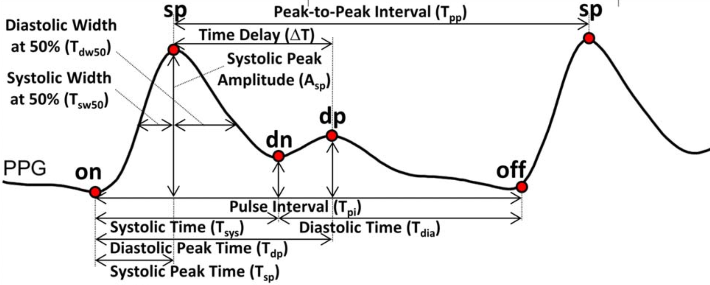
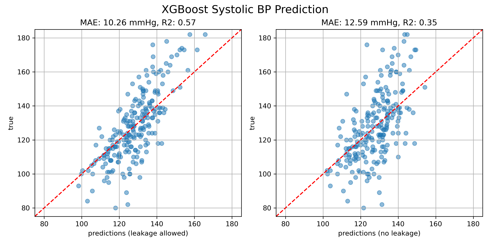



## Intro

PPG signals are collected from optical sensors on smart watches and pulse oximeters to measure heart rate and blood oxygen levels. New research has indicated the shape of the PPG waveform contains information on blood pressure, which could allow for "cuff-less" blood pressure measurements. This project lays out the pulse wave analysis method, that is how to process raw PPG signals into blood pressure values using machine learning.

## Methods

The goal in this post is to reproduce similar results to the paper by Gonzalez et al. (2023), which proposes a baseline for ... 

For now, we will extract features from the PPG waveforms using manually derived "biomarkers", or features extracted from the signal and its 1st, 2nd and 3rd derivatives. The processing pipeline includes 

1. Apply a Chebyshev bandpass filter to remove noise, find the derivatives
2. Segment pulses using a beat detection algorithm
3. Find "fiducial" points in the signal and derivatives
4. Process the fiducial points into "biomarkers"
5. Fit a machine learning algorithm using the biomarkers as predictors, and the systolic/diastolic blood pressure values as the response

For steps 1 to 4, the `pyPPG` library is used as a starter. This library was developed by ...

## Dataset

## Results

## References

González, Sergio, Wan-Ting Hsieh, and Trista Pei-Chun Chen. "A benchmark for machine-learning based non-invasive blood pressure estimation using photoplethysmogram." Scientific Data 10, no. 1 (2023): 149.

Goda, Márton Áron, Peter H. Charlton and Joachim A. Behar. “pyPPG: a Python toolbox for comprehensive photoplethysmography signal analysis.” Physiological Measurement 45 (2023)

Vest, Adriana Nicholson, Giulia Da Poian, Qiao Li, Chengyu Liu, Shamim Nemati, Amit J. Shah and Gari D. CliQord. “An open source benchmarked toolbox for cardiovascular waveform and interval analysis.” Physiological Measurement 39 (2018)
